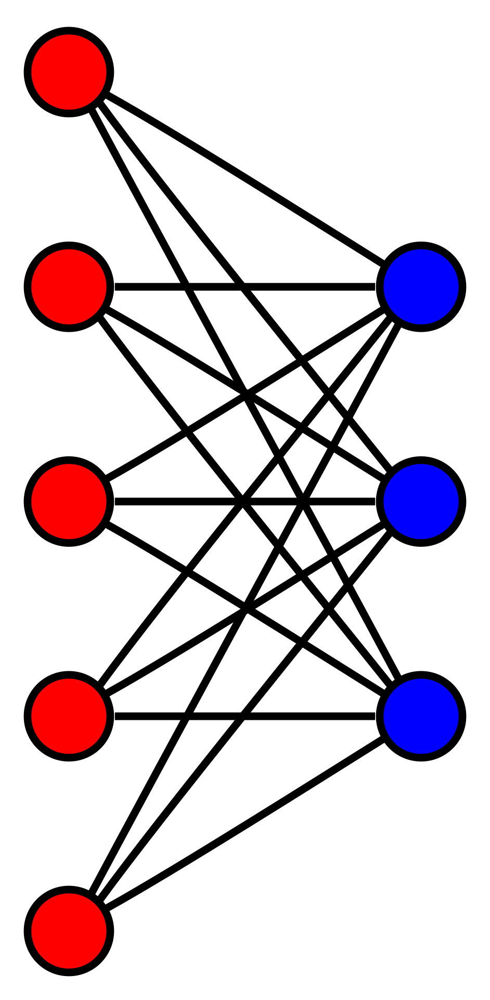

# Data Intelligence Applications - Pricing & Matching

    

## General setting

Consider a shop that sells two kinds of items, for example laptops and mouses. The shop is frequented by four possible customer classes: teenagers, young man/women, adults and elders. Furthermore, the shop starts a discount campaign which aims at boosting the number of mouses purchases: every customer that walks into the shop has a chance of recieving one of three possible coupons, which can be used in order to have a discount on a mouse if bought together with a laptop.  

    

Suppose:

* Since a mouse is useless on its own, we assume that every mouse purchase follows a laptop purchase;

* The main difference on the customer classes is their prior believe on which price is considered *affordable* for a given item;

* Three seasonal phases such that the transitions from a phase to the subsequent one are abrupt;

* For every customer, it is known the class he/she belogs to. Which basically means that we can tell the age group of a customer at glance.

In this scenario, the shop's goal is to maximize its revenue over a one-year time horizon, by selecting the best price for each item and optimizing the assignment of coupons.

## Pricing

Starting from a shop that knows every possible variable, we will toughen the environment conditions by reducing the shop's knowledge over a sequence of 8 steps. In the final step, the shop will have to learn every variable by means of multi-armed bandit and matching algorithms, trying to solve the optimization problem in a *non-stationary environnment*.

In a stationary environment, we were able to come up and compare different possible approaches that are well explained in the [PDF report](./assets/Data_Intelligence_application_Project.pdf).

In the picture below, consider the Clairvoyant as the optimum shop which knows every hidden variable. From the experiment shown, we selected the best performing model and we adepted it for the steps concerning a *non-stationary environment*.

    

As for the non-stationary environment, we considered abrupt changes in the conversion rates for the two items. In order to build a resilient model to such changes, we considered two approaches:
* A **Sliding Window** approach, which forgets outdated data points building a simpler yet more effective model.
* A **Change Detection** approach, which flushes every data point whenever it detects that the environment has changed, basically retraining the model from scratch.

    

    

The comparison and the implementation of all our methods are further described in the [PDF report](./assets/Data_Intelligence_application_Project.pdf). 

## Matching

We are interested in matching every customer that walks into the shop with exactly one coupon among those printed by the business unit of the shop. This problem can be described by means of a bipartite graph.

    

Every edge of this graph is weighted by the potential revenue that the matching would bring to the shop. In order to find the optimal assignment, we run a maximum cost assignment algorithm (Hungarian Algorithm).

When conversion rates are not a known variable, the edge weights can be learned by using bandit algorithms in a similar way described in the Pricing section (see Step 5).

## Team

- Francesco Amorosini [[Github](https://github.com/FrancescoAmorosini)] [[Email](mailto:francesco.amorosini@mail.polimi.it)]
- Alice Casali [[Github](https://github.com/AliceCasali)] [[Email](mailto:alice.casali@mail.polimi.it)]
- Anna Giovanacci [[Github](https://github.com/annagiovannacci)] [[Email](mailto:anna.giovannacci@mail.polimi.it)]
- Yunus Ege Saygılı [[Github](https://github.com/egesaygili)] [[Email](mailto:yunusege.saygili@mail.polimi.it)]